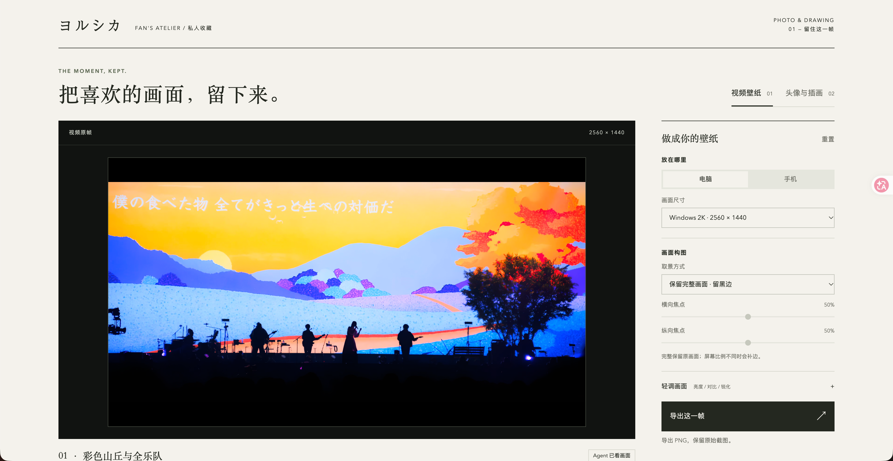
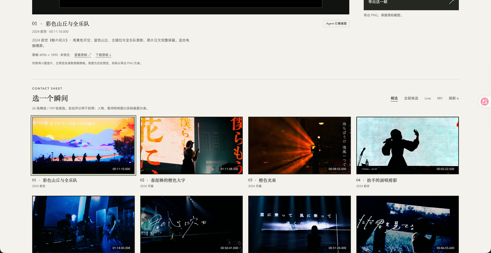
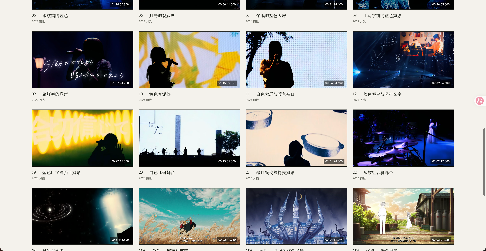
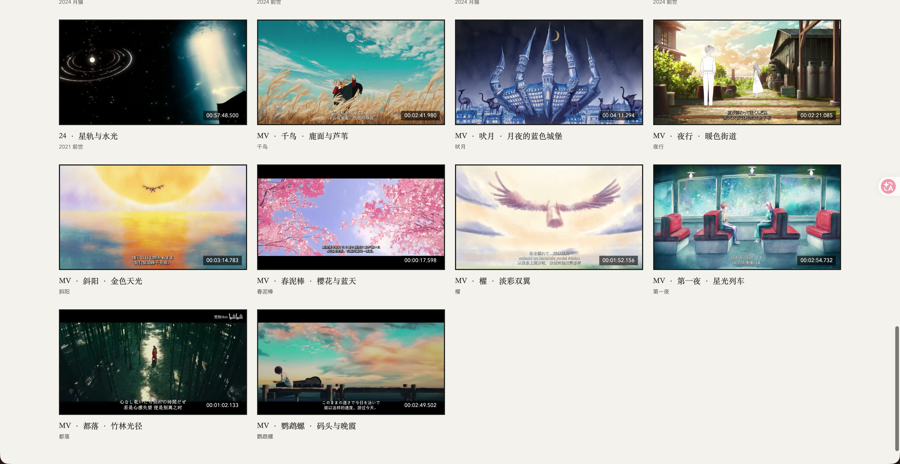
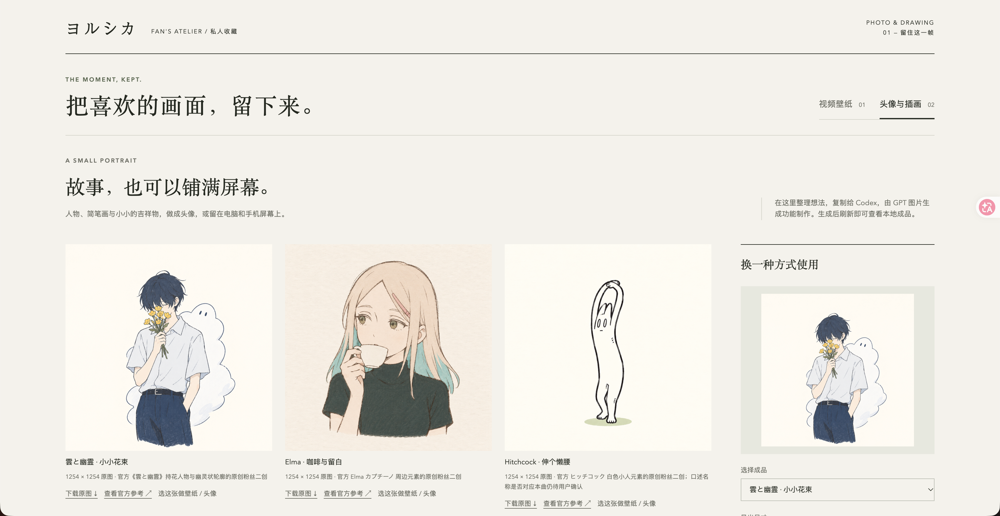
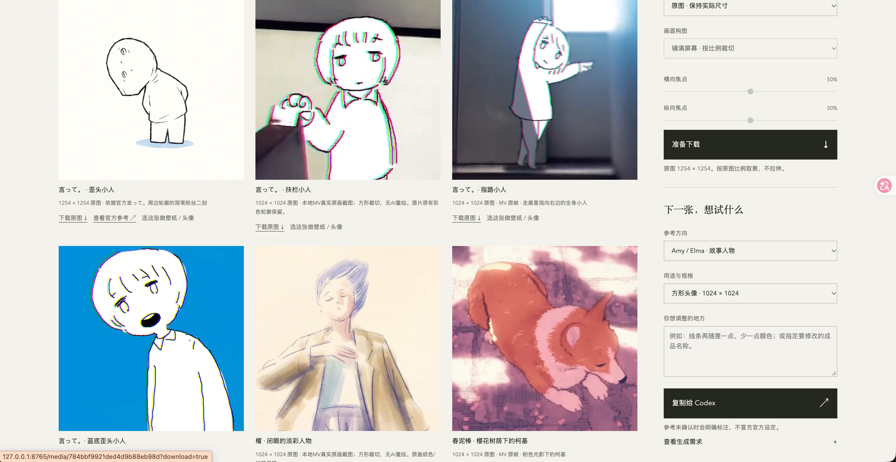

# ヨルシカ · 留住这一帧

给自己用的夜鹿壁纸、头像与插画工房。用本地 Live / MV 留下喜欢的真实画面，也可以让 GPT 参考官方人物和周边制作粉丝二创。

**告诉当前 GPT 想新增什么 → GPT 选片、制作、加入图库 → 刷新本机网页，查看和下载。**

## 界面预览

选择画面，调整电脑或手机尺寸，再导出 PNG。



<details>
<summary>展开查看 Live / MV 精选</summary>

Live 的舞台、大屏与演唱剪影，以及 MV 中适合留下的场景。





</details>

<details>
<summary>展开查看头像与插画</summary>

既有 GPT 制作的手绘二创，也有直接裁切 MV 原画的截图头像。




</details>

截图来自现有本机图库，用于展示界面；源码仓库不包含完整图库和原视频。

## 可以做什么

- 浏览精选、全部候选、Live 和 MV；选中后预览真实原帧，也可下载原图。
- 点击画面标题右侧的心形收藏，在“收藏”中集中查看；收藏保存在本机，刷新或重启后仍保留。
- 制作电脑、手机壁纸和方形头像，调整裁切位置与画面明暗。手机默认铺满裁切。
- 查看头像与插画的实际尺寸、来源，下载原图或重新裁切。
- 把创作或修改需求交给当前 GPT，由内置图像工具完成二创，再加入图库。

支持 iPhone 14 Plus、MacBook Pro 16、Windows 2K 等尺寸，也可自定义。网页在本机运行，手机选项指壁纸尺寸。

## 怎么用

需要 Python 3.10+，以及可用的 `ffmpeg` / `ffprobe`。首次准备：

```bash
python3 -m pip install -r requirements.txt
python3 main.py
```

打开 <http://127.0.0.1:8765>。已有依赖时直接启动即可，也可使用 `python3 studio.py`。

日常新增素材直接在 GPT 会话里说明，例如：

> 从 Live 里选几张有主唱剪影、大屏日文和漂亮灯光的壁纸，电脑和手机分别选构图。

> 参考官方 Elma 周边，做一张喝咖啡的简笔头像，留白多一点。

项目包含 `$yorushika-visuals` Skill，供当前 GPT 按既定标准制作。网页负责查看、调整和下载，图片创作由 GPT 会话执行。

默认 Python 依赖只有 FastAPI、Uvicorn、Pydantic、Pillow。前端使用普通 HTML / CSS / JavaScript，无需前端构建或外置 Agent 服务。

## 素材与画质

- 视频、候选、成品和来源记录保存在本机；`output/` 不上传 GitHub。换机器仅克隆源码会得到空图库，需要另行复制素材与 `output/`。
- Live / MV 截图保留真实画面，不用 AI 补脸、补字或造细节。放大属于插值，不能恢复模糊。
- GPT 作品标明参考和二创来源，属于非官方粉丝作品。
- 网页可导出当前选择；预先调好的设备版本保存在本机 `output/gallery-round4.html` 总览中。

## 继续维护

- [当前进度](CURRENT_PROGRESS.md)：最新素材、成品、验证和待办。
- [视觉指南](VISUAL_GUIDE.md)：选图样例、画质要求和设备裁切标准。
- [接手说明](AGENTS.md)与[项目 Skill](.agents/skills/yorushika-visuals/SKILL.md)：换会话或模型时先读。
- [视频工作流](.agents/skills/yorushika-visuals/references/live-workflow.md)、[官方参考](.agents/skills/yorushika-visuals/references/visual-sources.md)、[更新记录](CHANGELOG.md)。

测试：`python3 -m unittest discover -s tests -v`，额外测试依赖见 `requirements-dev.txt`。

旧歌词卡版本保留在 [codex/legacy-lyric-card](https://github.com/Yorushikamimimi/Yorushika-Lyric-Card-Bot/tree/codex/legacy-lyric-card) 分支，已停止维护。当前使用本地视觉工房。
